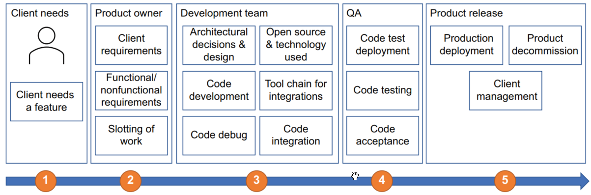
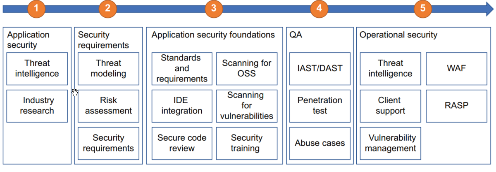

# Code-development-pipeline

## Dev

1. Client need
- Client need a feature
2. Product owner
- Client requirements
- Functional/ Nonfunctional requirements
- Slotting of work
3. Development team
- Architectural decisions & design
- Code development
- Code debug
- Open source & technology used
- Tool chain for integrations
- Code integration
4. QA
- Code test deployment
- Code testing
- Code acceptance
5. Product release 
- Production deployment
- Production decommission
- Client management
## Security

1. application security
- Threat intelligence
- Industry research
2. Security requirement
- Threat modeling
- Risk assessment
- Security requirements
3. Application security foundations
- Standards and requirements
- IDE integration
- Secure code review
- Scanning for OSS
- Scanning for vulnerabilities
- Security training
4. QA
- IAST/DAST
- Penetration Test
- Abuse cases
5. Operational security
- Threat intelligence
- Client support
- Vulnerability management
- WAF
- RASP 

## References 
<!-- - https://www.sonarsource.com/plans-and-pricing/enterprise/
- https://docs.gitlab.com/charts/
- https://www.snel.com/support/how-to-create-your-own-gitlab-server-on-ubuntu-18-04/
- https://cme241.github.io/
- https://huggingface.co/learn/deep-rl-course/en/unit0/introduction
- https://projects.animaapp.com/team/my-team-4sxpm3t/
- https://itch.io/games
- https://learn.mattr.global/tutorials/
- https://learn.mattr.global/api-reference/latest#operation/retrieveCustomDomain
- https://github.com/sahat/hackathon-starter
- https://avaloniaui.net/
- https://fxdocs.github.io/docs/html5/#_avoid_nulls_in_comboboxes
- https://github.com/picoe/Eto
- https://z-library.se/book/25195597/537226/windows-kernel-programming.html
- https://www.hackingarticles.in/editing-etc-passwd-file-for-privilege-escalation/
- https://open-security-summit.org/sessions/2022/mini-summits/dec/
- https://hackerone.com/opportunities/all
- https://www.trustradius.com/products/hackerone/reviews
- https://www.trustradius.com/products/bugbounter/reviews
- https://www.trustradius.com/products/bugcrowd/reviews
- https://www.trustradius.com/products/synack/reviews
- https://github.com/MichaelCade/90DaysOfDevOps/blob/main/2023/day14.md
- https://github.com/MichaelCade/90DaysOfDevOps/blob/main/2023.md
- https://github.com/MichaelCade/90DaysOfDevOps/blob/main/2022.md
- https://github.com/SonarSource/helm-chart-sonarqube/tree/master/charts/sonarqube
- https://www.geeksforgeeks.org/staying-anonymous-with-proxychains-in-kali-linux/
- https://sourceforge.net/projects/owaspbwa/files/
- https://sourceforge.net/projects/vapps/
- https://web.stanford.edu/class/cs142/lectures.html
- https://hub.docker.com/r/webgoat/webgoat/
- https://github.com/microsoft/Security-101
- https://learn.microsoft.com/en-us/training/modules/owasp-top-10-for-dotnet-developers/
- https://icitconf.org/important-date.html
- https://docs.securitytrails.com/docs/domain-names
- https://blackarch.org/social.html
- https://github.com/hailoc12/docbao
- https://github.com/harismuneer/Ultimate-Social-Scrapers
- https://developers.facebook.com/docs/sharing/webmasters/crawler/
- https://ieeexplore.ieee.org/document/9563948?denied=
- https://www.digitalocean.com/community/tutorials/how-to-install-and-configure-gitlab-on-ubuntu
- https://github.com/Ondrik8/byPass_AV/tree/master
- https://masothue.com/0304932727-cong-ty-co-phan-phan-mem-hoan-cau
- https://plotly.com/python/scattermapbox/
- https://geopandas.org/en/stable/
- https://dash.plotly.com/installation?_gl=1*5u2k05*_ga*NzgwMDY3ODA2LjE3MTUxNjMwODE.- *_ga_6G7EE0JNSC*MTcxNTE2MzA4MC4xLjEuMTcxNTE2MzE1MS42MC4wLjA.
- https://github.com/lebinh/vietnam-choropleth-map/blob/master/vietnam-choropleth-map.ipynb
- https://github.com/OWASP/NodeGoat
- https://github.com/OWASP/NodeGoat/releases
- https://whitehat.vn/threads/tin-tac-trung-quoc-nham-muc-tieu-vao-cac-to-chuc-tai-chinh-dai-loan.16317/
- https://viperone.gitbook.io/pentest-everything/psmapexec
- https://viperone.gitbook.io/pentest-everything
- https://viperone.gitbook.io/pentest-everything/everything/everything-active-directory/network-sniffing
- https://github.com/ryan412/ADLabsReview
- https://www.digitalocean.com/community/tutorials/build-a-to-do-application-using-django-and-react
- https://github.com/tales-aparecida/react-elasticsearch-django
- https://testdriven.io/blog/django-drf-elasticsearch/
- https://github.com/Hsins-Learn/Learn-Full-Stack-Development-with-Django-and-React/tree/main
- https://archive.org/details/pfSense-CE-2.6.0-RELEASE-amd64
- https://gns3.com/marketplace/labs
- https://www.ateam-oracle.com/post/simplify-your-day-with-ssh-config-file-entries-and-self-closing-tunnels
- https://docs.djangoproject.com/en/5.0/topics/testing/overview/
- https://docs.djangoproject.com/en/5.0/intro/tutorial02/
- https://djangopackages.org/packages/p/django-dashboards/
- https://djangopackages.org/grids/g/monitoring/
- https://dev.to/ifihan/exploring-djangos-third-party-packages-top-libraries-you-should-know-38km
- https://marketplace.visualstudio.com/items?itemName=AlexShen.classdiagram-ts
- https://h0mbre.github.io/Fuzzing-Like-a-Caveman-2/
- https://h0mbre.github.io/
- https://mmistakes.github.io/minimal-mistakes/docs/quick-start-guide/
- https://help.owasp-juice.shop/appendix/solutions.html
- https://github.com/juice-shop/juice-shop
- https://github.com/refabr1k/owasp-juiceshop-solutions/tree/master
- https://github.com/adeyosemanputra/pygoat/blob/master/Solutions/solution.md
- https://github.com/NextronSystems/APTSimulator
- https://github.com/gentilkiwi/mimikatz
- https://github.com/PowerShellMafia/PowerSploit
- https://github.com/besimorhino/powercat
- https://sspit.vn/top-5-he-dieu-hanh-cho-cybersecurity-or-hacker/
- https://csilinux.com/open-source-osint-tools-unveiling-the-power-of-command-line/
- https://django-extensions.readthedocs.io/en/latest/graph_models.html
- https://docs.djangoproject.com/en/5.0/ref/class-based-views/base/
- https://www.e-cq.net/
- https://blog.codacy.com/security-code-review-best-practices
- https://www.immersivelabs.com/
- https://www.multicharts.com/discussion/viewtopic.php?t=48948
- https://www.codeproject.com/Questions/1118291/Tool-for-testing-exactly-the-performance-of-progra
- https://github.com/quozd/awesome-dotnet
- https://min.io/
- https://blog.min.io/optimizing-ai-model-serving/
- https://blog.min.io/setting-up-a-development-machine-with-mlrun-and-minio/
- https://www.willianantunes.com/blog/2022/05/django-admin-authentication-using-sso-through-auth0/
- https://python.plainenglish.io/user-management-and-authentication-in-django-616e2d88ffdf
- https://stackoverflow.com/questions/68108761/django-keycloak-integration-flow
- https://www.linkedin.com/posts/brijpandeyji_ever-wondered-how-instagram-was-built-activity-7135953117564538880-PLpY
- https://www.youtube.com/watch?app=desktop&v=YMPhYQxnE-0
- https://www.youtube.com/watch?v=1UvTNMH7zDo
- https://fathinah.medium.com/calling-rest-api-with-jwt-authentication-in-django-b1c48b8018ed
- https://developer.mozilla.org/en-US/docs/Learn/Server-side/Django/Authentication#overview
- https://docs.djangoproject.com/en/5.0/topics/auth/default/
- https://www.zaproxy.org/getting-started/
- https://ajayproject.com/project17
- https://awstip.com/gitops-project-todo-application-using-circle-ci-and-argo-cd-f1ca009cf82e
- https://awstip.com/devsecops-eb73e2fb2bf5
- https://awstip.com/use-nginx-as-a-reverse-proxy-c707b92df373
- https://github.com/d-evil0per/Crawl-videos-with-selenium-using-python
- https://main--realworld-docs.netlify.app/docs/specs/backend-specs/api-response-format
- https://medium.com/@ericsimons/introducing-realworld-6016654d36b5
- https://github.com/django-cms/django-cms
- https://github.com/pennersr/django-allauth
- https://github.com/search?q=django+&type=repositories&s=forks&o=desc&p=3
- https://github.com/DefectDojo/django-DefectDojo
- https://github.com/agusmakmun/django-markdown-editor
- https://markdownmonster.west-wind.com/docs/_5ef0x96or.htm
- https://defectdojo.com/
- https://www.codeswithpankaj.com/post/create-a-login-logout-system-in-django-step-by-step-instructions
- https://grpc.io/docs/languages/python/basics/
- https://github.com/agusmakmun/django-markdown-editor/tree/master
- https://docs.pytest.org/en/8.2.x/
- https://github.com/Patrowl/PatrowlManager
- https://github.com/CycodeLabs/raven
- https://github.com/SecurityUniversalOrg/SecuSphere
- https://github.com/topics/security-automation?l=html
- https://github.com/topics/vulnerability-management?l=html
- https://github.com/cloudsecurelab/security-acronyms
- https://github.com/animo/awesome-self-sovereign-identity
- https://github.com/tno-ssi-lab/wallet-overview
- https://cycode.com/blog/github-actions-vulnerabilities/
- https://github.com/lukaszknysak/F5-Advanced-Web-Application-Firewall
- https://www.metadefencelabs.com/blog
- https://rtd-awf.readthedocs.io/en/dev/index.html
- https://app.vagrantup.com/boxes/search
- https://dummyjson.com/
- https://www.elastic.co/downloads/beats/packetbeat
- https://www.elastic.co/security-labs
- https://www.elastic.co/observability-labs/blog/elastic-rag-ai-assistant-application-issues-llm-github
- https://www.elastic.co/search-labs
- https://www.elastic.co/downloads/elasticsearch
- https://learn.netdata.cloud/docs/deployment-guides
- https://learn.netdata.cloud/docs/netdata-agent/installation/linux/native-linux-distribution-packages
- https://marketplace.visualstudio.com/search?target=VSCode&category=All%20categories&sortBy=Installs
- https://github.com/Ignitetechnologies/CTF-Difficulty
- https://github.com/daffainfo/ctf-writeup
- https://github.com/frenchbread/kloc
- https://github.com/Cyber-Buddy/APKHunt
- https://mobile-security.gitbook.io/masvs/0x03-using_the_masvs
- https://github.com/OWASP/www-project-top-10-for-large-language-model-applications
- https://github.com/OWASP/wstg
- https://github.com/OWASP/owasp-mastg
- https://mas.owasp.org/MASTG/techniques/android/MASTG-TECH-0025/
- https://owasp.org/www-project-devsecops-guideline/latest/02a-Static-Application-Security-Testing
- https://owasp.org/www-community/Source_Code_Analysis_Tools
- https://www.nist.gov/itl/ssd/software-quality-group/source-code-security-analyzers
- https://cloud.codethreat.com/
- https://v17.angular.io/guide/http-security-xsrf-protection
- https://medium.com/@Romser/soc250-apt35-hyperscrape-data-exfiltration-tool-detected-1f7ba5670695
- https://medium.com/@avaen/malware-analysis-digital-forensic-strela-stealer-9a3c3402c6bf
- https://ache.readthedocs.io/en/latest/
- https://vi.ldplayer.net/
- https://github.com/JarryShaw/darc
- https://jarryshaw.github.io/darc/
- https://github.com/Hrishikesh7665/Android-Pentesting-Checklist
- https://spec.torproject.org/index.html
- https://tails.net/
- https://www.helicard.com/
- https://securityonionsolutions.com/software
- https://github.com/mitre-attack/mitreattack-python
- https://oasis-open.github.io/cti-documentation/
- https://docs.suricata.io/en/latest/rules/index.html
- https://github.com/OISF/suricata
- https://github.com/cilium/cilium
- https://hub.docker.com/_/microsoft-mssql-server
- https://phoenixnap.com/kb/fix-sub-process-usr-bin-dpkg-returned-error-code-1
- https://devnetsandbox.cisco.com/DevNet/catalog/stealthwatch-sandbox#instructions
- https://www.metasploit.com/download
- https://gitlab.com/pages/hugo

- https://docs.rapid7.com/metasploit/metasploitable-2/
- https://scapy.readthedocs.io/en/latest/
- https://www.snort.org/documents
- https://explainshell.com/
- https://peps.python.org/pep-0008/#type-variable-names
- https://www.openvas.org/
- https://github.com/greenbone/
- https://documentation.wazuh.com/current/index.html
- https://docs.zeek.org/en/master/
- https://suricata.io/
- https://pubhub.devnetcloud.com/media/genie-docs/docs/index.html
- https://docs.rapid7.com/metasploit/
- https://www.ansible.com/
- https://github.com/splunk/attack_range
- https://www.parrotsec.org/docs/introduction/what-is-parrot
- https://www.jenkins.io/
- https://mininet.org/
- https://opennetworking.org/onos/
- https://docs.ansible.com/ansible/latest/index.html
- https://owasp.org/www-project-api-security/
- https://owasp.org/www-project-mobile-top-10/
- https://owasp.org/www-project-internet-of-things/
- https://www.thehacker.recipes/a-d/movement/credentials/cracking
- https://hashcat.net/wiki/doku.php?id=example_hashes -->